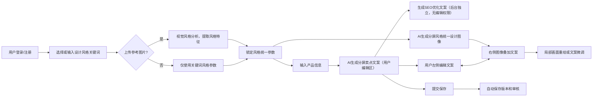

# 1，调用同接口修正文案，提高SEO关键词密度。关于这点用户的饿文案不需要影响我们的seo内容。2，用户输入关键词或选择平台预设风格（极简、现代、北欧、科技、环保等），平台锁定该风格，确保详情页所有分屏风格统一。这些风格有点模糊概念，这里用户可输入参考词和上传参考图，这样我们的设计会更加精准。3，输出完整技术需求文档、交互流程图这些也整合在我们的开发文档一起，方便我复制保存。

以下是整合你最新需求，结合之前内容完善的 **epageart.com** 完整开发文档，涵盖SEO规划、功能细节改进、API应用及交互流程图，方便直接复制保存使用。

# epageart.com 完整开发文档（2025版）

## 一、网站概述与定位

- **网站名称**：epageart
- **定位**：面向国际跨境电商的AI驱动详情页设计平台，帮助用户基于**风格锁定与精准设计要求**，快速生成视觉统一的详情页分屏内容与文案。
- **核心优势**：借助 https://api.apicore.ai 提供的大模型API，结合用户输入的精准风格参考词或上传的参考图，生成风格统一且SEO优化的电商详情页设计方案。
- **目标用户**：跨境电商卖家、品牌运营、电商设计师。


## 二、SEO 设计与关键词策略

### 1. SEO关键词逻辑

- **用户文案与SEO文案分离设计**：
— 用户编辑的文案不参与SEO关键词密度计算，保障SEO内容的专业性和排名稳定，避免因用户随意改写影响搜索表现。
— 后台通过独立AI生成的SEO文案片段用于页面meta、schema及隐藏SEO区块。
- **核心SEO关键词定位示范（标题、H1）**：
    - AI Ecommerce Product Detail Page Design
    - Ecommerce Page Layout Ideas
    - AI Product Description Generator
    - Multilingual Ecommerce SEO Optimization
    - Consistent Product Page Style
- **关键词嵌入点**：
    - Title、Meta Description
    - H1-H3文案标签
    - 图片Alt文本
    - schema.org结构化数据
    - 隐藏SEO内容区域（不可见但搜索引擎可读）


## 三、核心功能需求与优化细节

### 1. 风格输入及锁定机制（全新设计）

- **用户输入方式**：
    - _关键词输入_：用户自行输入风格参考词（支持多值输入，如“极简、北欧、环保”等）
    - _上传参考图_：用户上传图片，平台AI自动通过视觉特征分析提取风格要素。
- **系统处理**：
    - 对用户输入的关键词与参考图片进行融合解读，从中提炼核心风格标签和视觉元素指导后续设计模块生成。
    - 该风格信息将传递给后端AI调用接口，确保所有分屏设计在风格维度上高度统一。
- **锁定作用**：风格锁定后，所有详情页分屏自动按照该风格参数调节排版、色彩、字体、图像生成，防止分屏风格割裂。


### 2. AI文案生成与SEO内容管理

- **文案分层结构**：
    - _用户自定义文案区域_：完全由用户编辑，专注产品描述与卖点展示，不影响SEO排名算法。
    - _AI自动SEO文本层_：独立生成SEO关键词高密度文案，隐藏在页面SEO层或Meta标签中，提升谷歌排名且不暴露给普通用户。
- **文案修改流程**：
    - 用户编辑时，API只用于生成辅助文案或建议，不自动覆盖SEO层。
    - 后台定时触发SEO文案AI模型，更新SEO文案独立区，保证SEO内容专业且稳定。


### 3. 多分屏图像精准生成

- **输入增强**：用户上传的参考图，不仅作为AI绘图"草稿"，还作为视觉风格的示范。
- **图像生成方式**：调用 apicore.ai 图像生成与编辑API，结合“风格标签 + 参考图特征 + 用户提示词”，生成风格连贯、且视觉统一的详情页分屏画面。
- **局部编辑**：用户对某一分屏图片的局部需要变动时，AI仅在该屏范围响应，防止影响其他屏的视觉风格。


### 4. 交互设计细节

- **左右分屏直观模式**：
    - 左侧：分屏文案列表，用户点击可编辑，编辑区域支持富文本与多语言切换。
    - 右侧：对应分屏图像，文案位置直接可编辑，拖拽移动，支持文字样式微调。
- **图文联动**：文案在图像上的直接修改实时同步到文本编辑区，反之亦然。
- **风格锁定提示**：更改风格或参考图时，提供整体预览和确认，阻止无序编辑打破统一风格。


## 四、API集成与技术实现

### 1. 使用 https://api.apicore.ai 核心API

| 功能模块 | API类型 | 主要参数及用途 |
| :-- | :-- | :-- |
| 文本生成 | 文本生成（Anthropic/GPT） | 传入产品信息、风格关键词，生成卖点文案、SEO文案。 |
| 图像生成 | 图像生成（DALL·E、扩展） | 结合参考图base64编码、提示词和风格标签，输出分屏图片。 |
| 文本优化 | 文本编辑改写API | 配合文案建议，辅助用户优化文本，不影响SEO内容。 |
| 风格分析 | 图像风格分析API（自研或第三方） | 解析用户上传参考图提取风格特征，辅助风格统一。 |

### 2. 核心调用示例（Node.js）

```javascript
// 文案生成示例
async function generateProductCopy(productInfo, styleKeywords) {
  const prompt = `Generate ecommerce product detail page copy for product info: ${productInfo}, with style: ${styleKeywords}.`;
  const res = await axios.post('https://api.apicore.ai/v1/text/generate', {
    model: 'anthropic.claude-v1',
    prompt: prompt,
    max_tokens: 300
  }, { headers: { 'x-api-key': process.env.APICORE_API_KEY }});
  return res.data.choices[0].message.content;
}

// 图像生成示例
async function generateStyledImage(prompt, styleTags, base64Image) {
  const res = await axios.post('https://api.apicore.ai/v1/image/generate', {
    model: 'dall-e-3',
    prompt: prompt + " style: " + styleTags.join(', '),
    init_image: base64Image
  }, { headers: { 'x-api-key': process.env.APICORE_API_KEY }});
  return res.data.data[0].url;
}
```


## 五、交互流程图说明




## 六、技术架构建议

| 层级 | 技术选型 | 说明 |
| :-- | :-- | :-- |
| 前端 | React/Vue + 富文本编辑器 | 实时同步交互，支持分屏图文联动及多语言。 |
| 后端 | Node.js/Express | API代理聚合、高效调用apicore.ai。 |
| 数据库 | PostgreSQL/MongoDB | 用户数据、风格参数、历史版本保存。 |
| 实时协作 | WebSocket + Redis | 文案和设计实时协作与版本控制。 |
| CDN与SEO | NGINX + Google Search Console | 静态资源加速，SEO可视化管理与索引监控。 |
| AI服务调用 | apicore.ai 全套API | 文本生成、图像生成、风格分析。 |

## 七、总结

- 明确分离用户编辑内容和SEO文案，保证SEO稳定与专业。
- 具备关键词+参考图的精准风格输入，提升设计准确度和美学一致性。
- 利用 apicore.ai 全功能API，实现文案与图像智能生成和局部灵活编辑。
- 清晰分屏设计，文案与画面左右直观联动，提升用户体验。
- 完整的SEO结构设计，覆盖谷歌国际搜索排名重点。
- 交互流程和技术架构清晰，便于后续系统开发实施。

你可以直接复制此文档作为产品研发、设计和SEO优化的统一蓝本。

如需，我还可以帮你输出更具体的模块接口文档和详细前后端代码示例。

